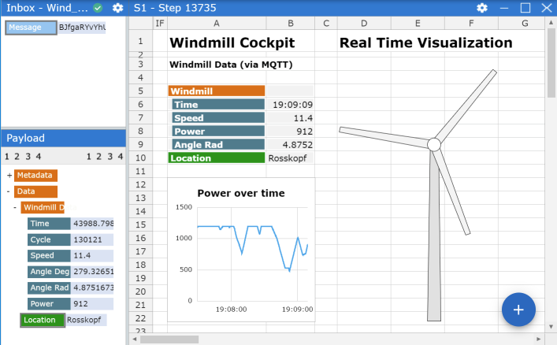
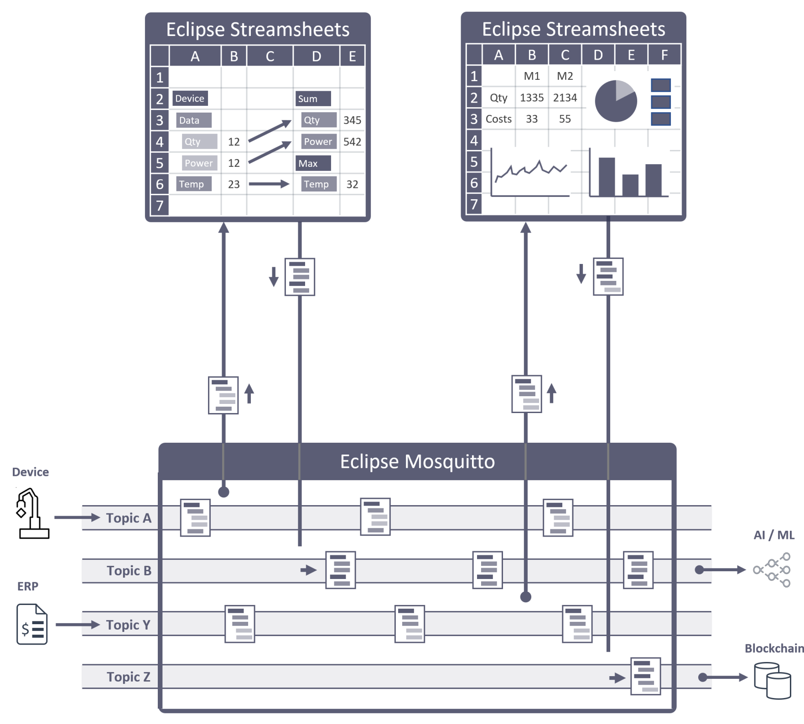

<section id="banner" class="banner" role="banner">
    
    <!-- sectiinclude needed here because nav is always in first container :-(  -->
    

        

            

                

                    
&nbsp;

                
<!-- banner text -->
            

            

                

                    <h1>Stream processing for everybody</h1>
                    
<b> Eclipse Streamsheets</b> - Anybody who knows how to use a spreadsheet can quickly build server-based, real-time applications, for any purpose. No programming required.

                    
<b>Eclipse Mosquitto</b> -  Devices and apps communicate in real-time, based the most popular broker technology in the world.

                    

                        <a href="#" class="js-video-button btn btn-large" data-video-id='cYKJe4FtUFg'>Watch Video</a>
                        <a href="#products" class="btn btn-large">Cedalo Cloud</a>
                        <a href="#download" class="btn btn-large">Download</a>
                    

                
<!-- banner text -->
            

            

                

                    
                
<!-- banner text -->
            

        

    

</section><!-- banner -->
<section id="products" class="products section">
    

        

            
  
                

                    <h1 class="section-header">The democratization of stream processing solutions</h1>
                

            

            
  
                

                    <h2>Eclipse Streamsheets</h2>
                    
Our no-code user interface is the all-familiar spreadsheet. But that’s all what Streamsheets have in common with traditional spreadsheets.

                    
While spreadsheets are client apps which work with bound and de-coupled batches of data, Streamsheets continuously process, aggregate, visualize and transform unbound data streams in real-time as a server app (microservice).

                    
Streamsheets were designed with publish/subcribe streaming protocols like MQTT, Apache Kafka or AMQP in mind, but they also work perfectly with REST-based protocols (request/response)

                    

                        <a href="#banner" class="btn btn-large">Watch Video</a>
                        <a href="#blog" class="btn btn-large">Learn More</a>
                    

                

                

                    <h2>Eclipse Mosquitto</h2>
                    
Eclipse Mosquitto is the most popular MQTT broker in the world and the perfect streaming platform for Streamsheets. Mosquitto supports unlimited hierarchical topics and the highly flexible publish/subscribe communication pattern.
 
                    
With the Mosquitto broker you can connect sensors, devices and apps far more flexible than in the request/response communication pattern of traditional client/server architectures.

                    
Eclipse Mosquitto supports guaranteed delivery of messages which allows use cases not only in IoT and Smart Factory, but also in financial and other non-IoT applications.

                    

                        <a href="#banner" class="btn btn-large">Watch Video</a>
                        <a href="#blog" class="btn btn-large">Learn More</a>
                    

                

            

            

                

                    
                

            

        

    

</section>

<section id="features" class="features section">
    

        

            

                

                    
                    <h3>Powerful Dashboards</h3>
                    
We include extensive charting features including custom charts that update immediately with real-time data. No need to install third-party chart extensions. Have a look at the charts gallery.

                

            

            

                

                    
                    <h3>On-Event or Cyclic</h3>
                    
Streamsheets calculate their formulas on each incoming stream event or based on a cycle timer. You can set the cycle timer to control how often a Sheet receives, processes and sends data.

                

            

            

                

                    
                    <h3>Milliseconds Automation</h3>
                    
Real-time event streams from technical or financial applications can have a very high frequencies. Streamsheets are able to run 1000 up to cycles per second to guarantee precise results.

                

            

            

                

                    
                    <h3>Server-based 24/7 - non-stop</h3>
                    
Streamsheets run on their own, even if you close the browser window. They run as microservices, 24 hours a day, receiving data from multiple sources, transforming it, and sending it out again.

                

            

            

                

                    
                    <h3>Open-Source  & Premium</h3>
                    
Both Mosquitto and Streamsheets are Eclipse IoT open-source projects which are commercially sponsored by Cedalo. We also offer premium editions of both products named Cedalo Sheets and Cedalo Broker.

                

            

             

                

                    
                    <h3>On-Premises & Cloud</h3>
                    
Our products run  as managed service in the Cedalo Cloud, on your AWS or Azure account or on-premises under any major operating system. They even run on edge devices with weak CPUs or on the Raspberry Pi.

                

            

        

    

</section><!-- features -->

<section id="usecases" class="usecases section" >
    

        

            
  
                

                    <h1 class="section-header">Use Cedalo Sheets to build solutions for wide variety of use cases</h1>
                

            

            
  
                

                    

                        <h2>Smart Factory & IIoT</h2>
                        <h5>Automotive, Energy, Aerospace</h5>
                    

                    

                        
With Cedalo Sheets, anybody who knows how to use a spreadsheet can quickly build real-time, stream processing applications, for any purpose.

                        <ul>
                        <li>Dashboards and Stream Charting</li>
                        <li>Condition Monitoring and Alerts</li>
                        <li>Analytics, Visualization, Digital Twin</li>
                        <li>Protocol conversion (OPC UA ↔ MQTT ↔ KAFKA)</li>
                        </ul>
                    

                

            

            
  
                

                    

                        <h2>Financial Services</h2>
                        <h5>Banking, Payments, Securities</h5>
                    

                    

                        
With Cedalo Sheets, anybody who knows how to use a spreadsheet can quickly build real-time, stream processing applications, for any purpose.

                        <ul>
                        <li>Real-time Analytics</li>
                        <li>Fraud Detection</li>
                        <li>Regulatory compliance</li>
                        <li>Customer tracking </li>
                        </ul>
                    

                

            

            
  
                

                    

                        <h2>Medical Services</h2>
                        <h5>Healthcare, Clinics, Pharmaceutical </h5>
                    

                    

                        
With Cedalo Sheets, anybody who knows how to use a spreadsheet can quickly build real-time, stream processing applications, for any purpose.

                        <ul>
                        <li>Dashboards and Stream Charting</li>
                        <li>Condition Monitoring and Alerts</li>
                        <li>Analytics, Visualization, Digital Twin</li>
                        <li>Protocol conversion (OPC UA ↔ MQTT ↔ KAFKA)</li>
                        </ul>
                    

                

            

            
  
                

                    

                        <h2>Smart Grids & Logistics</h2>
                        <h5>Oil & Gas, Electric Power, Transportation</h5>
                    

                    

                       
With Cedalo Sheets, anybody who knows how to use a spreadsheet can quickly build real-time, stream processing applications, for any purpose.

                        <ul>
                        <li>Dashboards and Stream Charting</li>
                        <li>Condition Monitoring and Alerts</li>
                        <li>Analytics, Visualization, Digital Twin</li>
                        <li>Protocol conversion (OPC UA ↔ MQTT ↔ KAFKA)</li>
                        </ul>
                    

                

            

            
  
                

                    

                        <h2>Stream Charts</h2>
                        <h5>Streaming data everywhere.</h5>
                    

                    

                        
With Cedalo Sheets, anybody who knows how to use a spreadsheet can quickly build real-time, stream processing applications, for any purpose.

                        <ul>
                        <li>Dashboards and Stream Charting</li>
                        <li>Condition Monitoring and Alerts</li>
                        <li>Analytics, Visualization, Digital Twin</li>
                        <li>Protocol conversion (OPC UA ↔ MQTT ↔ KAFKA)</li>
                        </ul>
                    

                

            

            
  
                

                    

                        <h2>Stream Gateways</h2>
                        <h5>Streaming data everywhere.</h5>
                    

                    

                        
With Cedalo Sheets, anybody who knows how to use a spreadsheet can quickly build real-time, stream processing applications, for any purpose.

                        <ul>
                        <li>Dashboards and Stream Charting</li>
                        <li>Condition Monitoring and Alerts</li>
                        <li>Analytics, Visualization, Digital Twin</li>
                        <li>Protocol conversion (OPC UA ↔ MQTT ↔ KAFKA)</li>
                        </ul>
                    

                

            

        

    

</section><!-- usecase -->

<section id="download" class="section downloads">
    

        

            

                

                    <h1 class="section-header">Get Started! Open-Source or Premium.</h1>
                    
In addition to sponsoring the two Open-Source projects "Eclipse Streamsheets" and "Eclipse Mosquitto" Cedalo also offers premium editions of both products. They are called "Cedalo Sheets" and "Cedalo Broker". Try the Cedalo premium edition free for 14 days.

                

            

            

                
                

                    <h2>Managed Service</h2>
                    
Cras justo odio, dapibus ac facilisis in, egestas eget quam. Nullam quis risus eget urna mollis ornare vel eu leo. Donec ullamcorper nulla non metus auctor fringilla.

                    
<a href="#cloud" class="btn btn-large">Cedalo Cloud</a>

                

            

            

                
                

                    <h2>On-Premises</h2>
                    
Cras justo odio, dapibus ac facilisis in, egestas eget quam. Nullam quis risus eget urna mollis ornare vel eu leo. Donec ullamcorper nulla non metus auctor fringilla.

                    
<a href="#cloud" class="btn btn-large">Download</a>

                

            

            

                
                

                    <h2>Edge Devices</h2>
                    
Cras justo odio, dapibus ac facilisis in, egestas eget quam. Nullam quis risus eget urna mollis ornare vel eu leo. Donec ullamcorper nulla non metus auctor fringilla.

                    
<a href="#cloud" class="btn btn-large">Download</a>

                

            

        

    

</section><!-- download -->

<section id="blog" class="section teams">
    

        

            

                

                    <h1 class="section-header">Visit our blog for more use cases</h1>
                    
In addition to sponsoring the two Open-Source projects "Eclipse Streamsheets" and "Eclipse Mosquitto" Cedalo also offers premium editions of both products. They are called "Cedalo Sheets" and "Cedalo Broker" and you can try them free for 14 days.

                

            

            

                

                    
                    

                        <h4>Ruth Wood</h4>
                        <h5 class="role">Founder, CEO</h5>
                        
Fusce dapibus, tellus ac cursus commodo, tortor mauris condimentum nibh, ut fermentum massa justo sit amet risus. Maecenas sed diam eget risus varius blandit sit amet non magna. Nullam quis risus eget urna mollis ornare vel eu leo.

                    

                
<!-- person -->
            

            

                

                    
                    

                        <h4>Timothy Reed</h4>
                        <h5 class="role">Co-Founder, Developer</h5>
                        
Fusce dapibus, tellus ac cursus commodo, tortor mauris condimentum nibh, ut fermentum massa justo sit amet risus. Maecenas sed diam eget risus varius blandit sit amet non magna. Nullam quis risus eget urna mollis ornare vel eu leo.

                    

                
<!-- person -->
            

            

                

                    
                    

                        <h4>Victoria Valdez</h4>
                        <h5 class="role">UI Designer</h5>
                        
Fusce dapibus, tellus ac cursus commodo, tortor mauris condimentum nibh, ut fermentum massa justo sit amet risus. Maecenas sed diam eget risus varius blandit sit amet non magna. Nullam quis risus eget urna mollis ornare vel eu leo.

                    

                
<!-- person -->
            

            

                

                    
                    

                        <h4>Beverly Little</h4>
                        <h5 class="role">Data Scientist</h5>
                        
Fusce dapibus, tellus ac cursus commodo, tortor mauris condimentum nibh, ut fermentum massa justo sit amet risus. Maecenas sed diam eget risus varius blandit sit amet non magna. Nullam quis risus eget urna mollis ornare vel eu leo.

                    

                
<!-- person -->
            

        

    

</section><!-- blog -->

