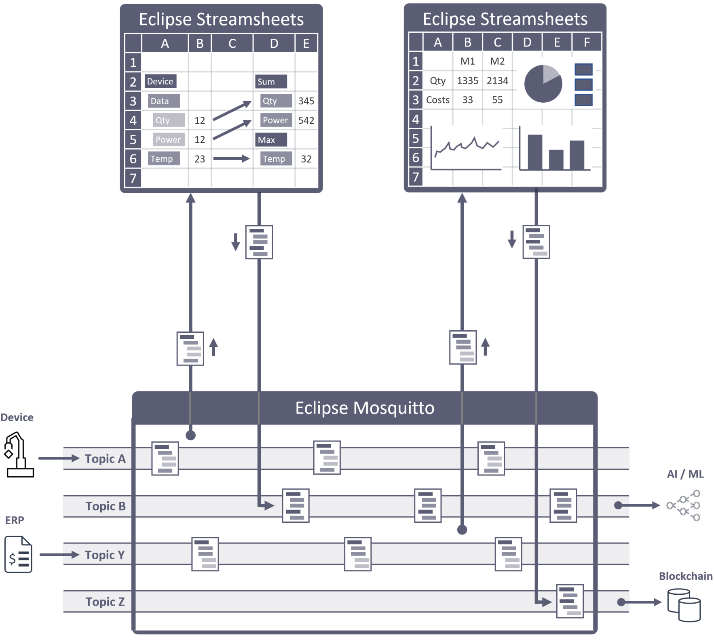

<section id="banner" class="banner" role="banner">
    
    <!-- sectiinclude needed here because nav is always in first container :-(  -->
    

        

            

                

                    
&nbsp;

                
<!-- banner text -->
            

            

                

                    <h1>Stream processing for everybody</h1>
                    
Cedalo is the commercial sponsor of  two Open-Source projects:

                    
<b> Eclipse Streamsheets</b> - Anybody who knows how to use a spreadsheet can quickly build server-based, real-time applications, for any purpose. No programming required.

                    
<b>Eclipse Mosquitto</b> -  Devices and apps communicate in real-time, based the most popular broker technology in the world.

                        <a href="#" class="js-video-button btn btn-large" data-video-id='cYKJe4FtUFg'>Watch Video</a>
                        <a href="#products" class="btn btn-large">Cedalo Cloud</a>
                        <a href="#download" class="btn btn-large">Download</a>  
                
<!-- banner text -->
            

            

                

                    
                
<!-- banner text -->
            

        

    

</section><!-- banner -->
<section id="products" class="products section">
    <h1 class="section-header">The democratization of stream processing solutions</h1>
    

        

            
  
                

                    <h2>Eclipse Streamsheets</h2>
                    
To understand Cedalo Sheets, it helps to know our mission:

                    <ul>
                        <li>no-code user interface</li>
                        <li>universal bridge to Web-, IoT- & Broker-protocols</li>
                        <li>analytics, visualization, and automation</li>
                    </ul>
                    
Our no-code user interface is the all-familiar spreadsheet. The no-code parts include functions, just like a spreadsheet, and wizards to connect to data.

                     
                        <a href="#banner" class="btn btn-large">Watch Video</a>
                        <a href="#blog" class="btn btn-large">Learn More</a>
                

                

                    <h2>Eclipse Mosquitto</h2>
                    
To understand Cedalo Sheets, it helps to know our mission:

                    <ul>
                        <li>no-code user interface</li>
                        <li>universal bridge to Web-, IoT- & Broker-protocols</li>
                        <li>analytics, visualization, and automation</li>
                    </ul>
                    
Our no-code user interface is the all-familiar spreadsheet. The no-code parts include functions, just like a spreadsheet, and wizards to connect to data.

                     
                        <a href="#banner" class="btn btn-large">Watch Video</a>
                        <a href="#blog" class="btn btn-large">Learn More</a>
                

            

            

                

                    
                

            

        

    

</section>

<section id="features" class="features section">
    <h1 class="section-header">Quick overview: An impressive feature set</h1>
    

        

            

                
                

                    <h5>Easily Customised</h5>
                    
Cras justo odio, dapibus ac facilisis in, egestas eget quam. Nullam quis risus eget urna mollis ornare vel eu leo. Donec ullamcorper nulla non metus auctor fringilla.

                

            

            

                
                

                    <h5>Responsive Ready</h5>
                    
Cras justo odio, dapibus ac facilisis in, egestas eget quam. Nullam quis risus eget urna mollis ornare vel eu leo. Donec ullamcorper nulla non metus auctor fringilla.

                

            

            

                
                

                    <h5>Modern Design</h5>
                    
Cras justo odio, dapibus ac facilisis in, egestas eget quam. Nullam quis risus eget urna mollis ornare vel eu leo. Donec ullamcorper nulla non metus auctor fringilla.

                

            

            

                
                

                    <h5>Clean Code</h5>
                    
Cras justo odio, dapibus ac facilisis in, egestas eget quam. Nullam quis risus eget urna mollis ornare vel eu leo. Donec ullamcorper nulla non metus auctor fringilla.

                

            

            

                
                

                    <h5>Ready to Ship</h5>
                    
Cras justo odio, dapibus ac facilisis in, egestas eget quam. Nullam quis risus eget urna mollis ornare vel eu leo. Donec ullamcorper nulla non metus auctor fringilla.

                

            

            

                
                

                    <h5>Download for Free</h5>
                    
Cras justo odio, dapibus ac facilisis in, egestas eget quam. Nullam quis risus eget urna mollis ornare vel eu leo. Donec ullamcorper nulla non metus auctor fringilla.

                

            

        

    

</section><!-- features -->

<section id="usecases" class="usecases section" >
    <h1 class="section-header">Use Cedalo Sheets to build solutions for wide variety of use cases</h1>
    

        

            
  
                

                    

                        <h2>Smart Factory</h2>
                        <h5>Streaming data everywhere.</h5>
                    

                    

                        
With Cedalo Sheets, anybody who knows how to use a spreadsheet can quickly build real-time, stream processing applications, for any purpose.

                        <ul>
                        <li>no-code user interface</li>
                        <li>universal bridge to industry protocols</li>
                        <li>analytics, visualization, and automation</li>
                        </ul>
                        
By combining these features in one application, we've solved a major problem for non-technical users who want code-free digital enterprise solutions.

                    

                

            

            
  
                

                    

                        <h2>Real-Time Finance</h2>
                        <h5>Streaming data everywhere.</h5>
                    

                    

                        
With Cedalo Sheets, anybody who knows how to use a spreadsheet can quickly build real-time, stream processing applications, for any purpose.

                        <ul>
                        <li>no-code user interface</li>
                        <li>universal bridge to industry protocols</li>
                        <li>analytics, visualization, and automation</li>
                        </ul>
                        
By combining these features in one application, we've solved a major problem for non-technical users who want code-free digital enterprise solutions.

                    

                

            

            
  
                

                    

                        <h2>Stream Analytics</h2>
                        <h5>Streaming data everywhere.</h5>
                    

                    

                        
With Cedalo Sheets, anybody who knows how to use a spreadsheet can quickly build real-time, stream processing applications, for any purpose.

                        <ul>
                        <li>no-code user interface</li>
                        <li>universal bridge to industry protocols</li>
                        <li>analytics, visualization, and automation</li>
                        </ul>
                        
By combining these features in one application, we've solved a major problem for non-technical users who want code-free digital enterprise solutions.

                    

                

            

            
  
                

                    

                        <h2>Stream Processors</h2>
                        <h5>Streaming data everywhere.</h5>
                    

                    

                        
With Cedalo Sheets, anybody who knows how to use a spreadsheet can quickly build real-time, stream processing applications, for any purpose.

                        <ul>
                        <li>no-code user interface</li>
                        <li>universal bridge to industry protocols</li>
                        <li>analytics, visualization, and automation</li>
                        </ul>
                        
By combining these features in one application, we've solved a major problem for non-technical users who want code-free digital enterprise solutions.

                    

                

            

            
  
                

                    

                        <h2>Stream Charts</h2>
                        <h5>Streaming data everywhere.</h5>
                    

                    

                        
With Cedalo Sheets, anybody who knows how to use a spreadsheet can quickly build real-time, stream processing applications, for any purpose.

                        <ul>
                        <li>no-code user interface</li>
                        <li>universal bridge to industry protocols</li>
                        <li>analytics, visualization, and automation</li>
                        </ul>
                        
By combining these features in one application, we've solved a major problem for non-technical users who want code-free digital enterprise solutions.

                    

                

            

            
  
                

                    

                        <h2>Stream Gateways</h2>
                        <h5>Streaming data everywhere.</h5>
                    

                    

                        
With Cedalo Sheets, anybody who knows how to use a spreadsheet can quickly build real-time, stream processing applications, for any purpose.

                        <ul>
                        <li>no-code user interface</li>
                        <li>universal bridge to industry protocols</li>
                        <li>analytics, visualization, and automation</li>
                        </ul>
                        
By combining these features in one application, we've solved a major problem for non-technical users who want code-free digital enterprise solutions.

                    

                

            

        

    

</section><!-- usecase -->

<section id="download" class="section download">
    

        

            

                

                    <h1 class="section-header">Get Started! Open-Source or Premium.</h1>
                    
In addition to sponsoring the two Open-Source projects "Eclipse Streamsheets" and "Eclipse Mosquitto" Cedalo also offers premium editions of both products, called "Cedalo Sheets" and "Cedalo Broker".

                

            

            

                
                

                    <h2>Managed Service</h2>
                    
Cras justo odio, dapibus ac facilisis in, egestas eget quam. Nullam quis risus eget urna mollis ornare vel eu leo. Donec ullamcorper nulla non metus auctor fringilla.

                    <a href="#cloud" class="btn">Cedalo Cloud</a>
                

            

            

                
                

                    <h2>On-Premises</h2>
                    
Cras justo odio, dapibus ac facilisis in, egestas eget quam. Nullam quis risus eget urna mollis ornare vel eu leo. Donec ullamcorper nulla non metus auctor fringilla.

                

            

            

                
                

                    <h2>Edge Device</h2>
                    
Cras justo odio, dapibus ac facilisis in, egestas eget quam. Nullam quis risus eget urna mollis ornare vel eu leo. Donec ullamcorper nulla non metus auctor fringilla.

                

            

        

    

</section><!-- download -->

<section id="blog" class="section teams">
    <h1 class="section-header">Visit our blog with many interesting videos.</h1>
    

        

            

                

                    
                    

                        <h4>Ruth Wood</h4>
                        <h5 class="role">Founder, CEO</h5>
                        
Fusce dapibus, tellus ac cursus commodo, tortor mauris condimentum nibh, ut fermentum massa justo sit amet risus. Maecenas sed diam eget risus varius blandit sit amet non magna. Nullam quis risus eget urna mollis ornare vel eu leo.

                    

                
<!-- person -->
            

            

                

                    
                    

                        <h4>Timothy Reed</h4>
                        <h5 class="role">Co-Founder, Developer</h5>
                        
Fusce dapibus, tellus ac cursus commodo, tortor mauris condimentum nibh, ut fermentum massa justo sit amet risus. Maecenas sed diam eget risus varius blandit sit amet non magna. Nullam quis risus eget urna mollis ornare vel eu leo.

                    

                
<!-- person -->
            

            

                

                    
                    

                        <h4>Victoria Valdez</h4>
                        <h5 class="role">UI Designer</h5>
                        
Fusce dapibus, tellus ac cursus commodo, tortor mauris condimentum nibh, ut fermentum massa justo sit amet risus. Maecenas sed diam eget risus varius blandit sit amet non magna. Nullam quis risus eget urna mollis ornare vel eu leo.

                    

                
<!-- person -->
            

            

                

                    
                    

                        <h4>Beverly Little</h4>
                        <h5 class="role">Data Scientist</h5>
                        
Fusce dapibus, tellus ac cursus commodo, tortor mauris condimentum nibh, ut fermentum massa justo sit amet risus. Maecenas sed diam eget risus varius blandit sit amet non magna. Nullam quis risus eget urna mollis ornare vel eu leo.

                    

                
<!-- person -->
            

        

    

</section><!-- blog -->

